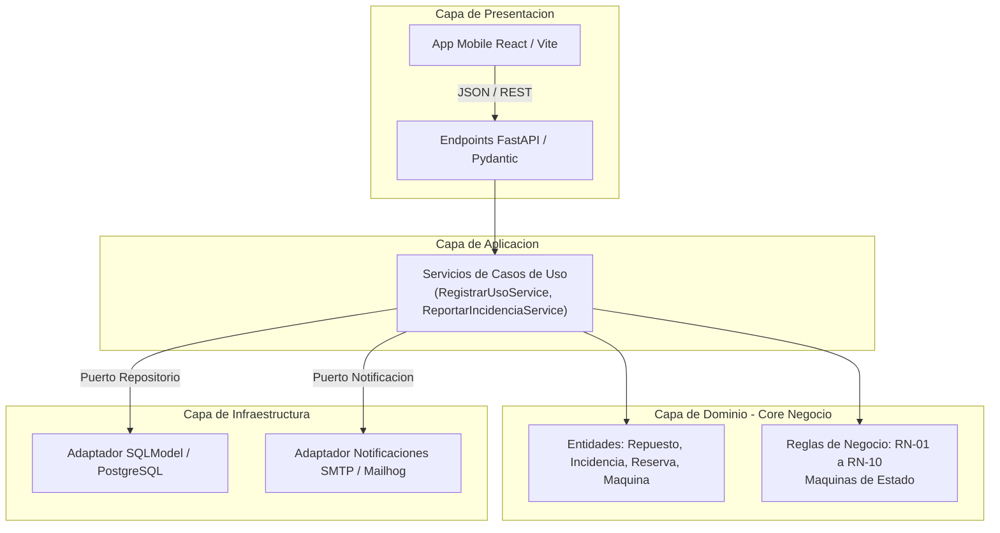

# ADR 01: Adopción de Arquitectura Multicapa con Enfoque en Puertos y Adaptadores

* **Estado:** Aceptado
* **Fecha:** 2026-09-18
* **Contexto:** Entrega M1 — Sistema de Gestión de Planta Farmacéutica

---

## 1. Contexto y Problemática
El sistema debe administrar operaciones críticas en planta farmacéutica bajo operación continua de 3 turnos rotativos. Requiere desacoplar las reglas de negocio (cálculo de stock disponible, umbrales y trazabilidad inmutable) de los mecanismos de persistencia, interfaz web y servicios de notificación externos (como Mailhog para RN-09).

## 2. Decisión
Se adopta una **Arquitectura Multicapa** combinada con **Puertos y Adaptadores (Hexagonal liviana)**:

1. **Capa de Presentación (Frontend / API):**
   * Mobile-first con React + TypeScript + Vite para operarios y personal técnico.
   * Controladores y routers REST en FastAPI que validan esquemas de entrada (Pydantic).
2. **Capa de Aplicación / Servicios:**
   * Orquesta los Casos de Uso (ej: `RegistrarConsumoService`, `ReportarIncidenciaService`).
   * Maneja los límites transaccionales de base de datos.
3. **Capa de Dominio (Núcleo del Negocio):**
   * Contiene los modelos del dominio y las máquinas de estados.
   * Ejecuta las reglas de negocio puras (RN-01 a RN-10) sin dependencias a librerías externas o frameworks web.
4. **Capa de Infraestructura y Adaptadores:**
   * Persistencia relacional mediante SQLModel/SQLAlchemy sobre PostgreSQL.
   * Implementación del puerto de notificaciones (`EmailNotificationAdapter`) mediante SMTP contra Mailhog en Docker.

---

## 3. Diagrama de Arquitectura Multicapa

## 4. Consecuencias
Positivas
Testabilidad aislada: La lógica de stock y transiciones de estados se testea con tests unitarios sin levantar base de datos ni servidores web.

Sustituibilidad de adaptadores: El servicio de notificaciones funciona en desarrollo local con Mailhog sin requerir servidores SMTP productivos.

Mantenibilidad: Evita la fuga de lógica empresarial en componentes de interfaz o consultas SQL directas.

Negativas / Mitigaciones
Mayor cantidad de archivos y transformaciones intermedias de datos (DTOs/Schemas a modelos de dominio). Se mitiga mediante SQLModel que unifica esquemas Pydantic con tablas de base de datos.