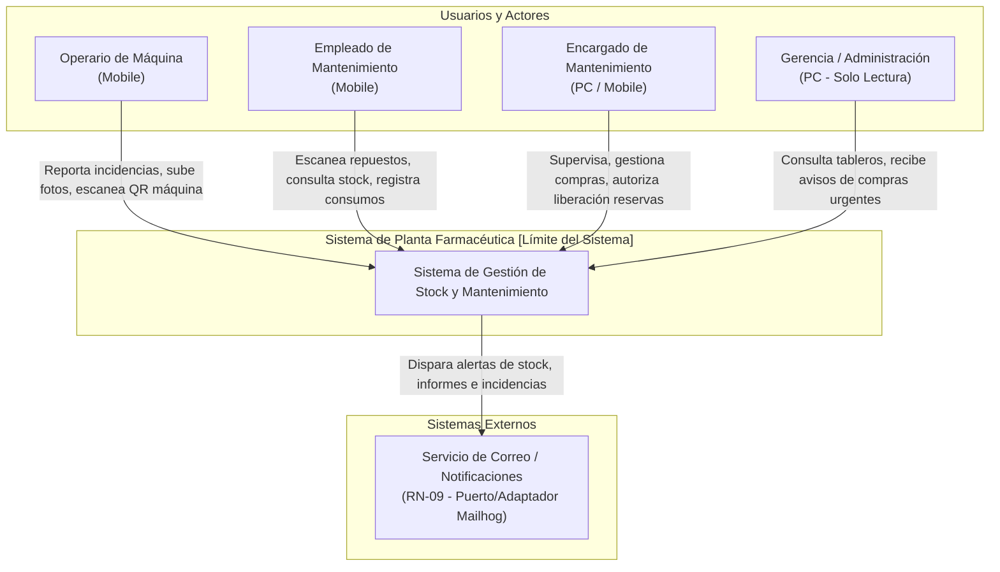
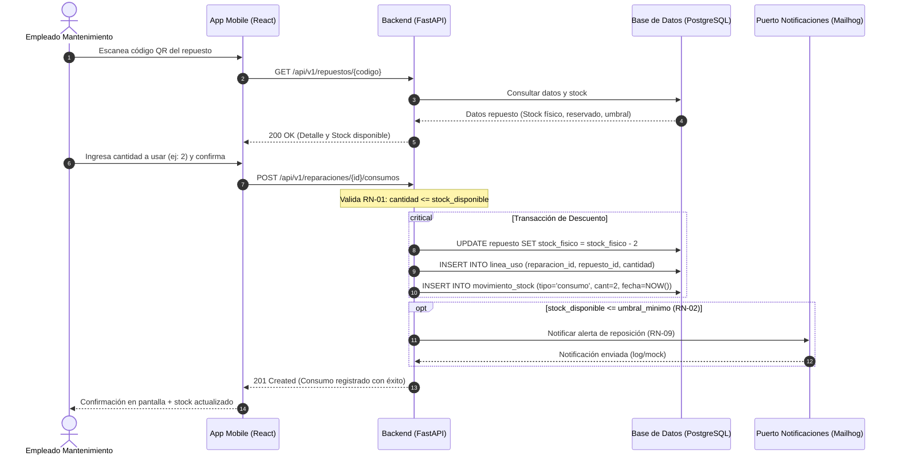

# Especificación de Casos de Uso y Diagramas de Interacción (M1)

> Alcance correspondiente al Núcleo de 3 integrantes: Registrar uso de repuesto (RN-01, RN-02, RN-06), Cargar stock recibido (RN-08) y Reportar Incidencia con QR.

---

## 1. Diagrama de Contexto del Sistema

## 2. Caso de Uso Principal (CUN): CU-01 Registrar Uso de Repuesto en Reparación 
Identificador: CU-01

Nombre: Registrar uso de repuesto en reparación

Actor Principal: Empleado de Mantenimiento

Precondiciones:

El empleado de mantenimiento se encuentra autenticado en la aplicación móvil.

Existe una Incidencia/Reparación activa sobre una máquina.

El repuesto posee un código QR/barras válido y está registrado en el catálogo.

Escenario Principal (Flujo Básico)

El empleado escanea con la cámara del celular el código QR/barras del repuesto utilizado.

El sistema busca el repuesto, valida su existencia y muestra en pantalla: código, nombre, ubicación física (A-03-12), stock físico y stock disponible.

El empleado ingresa la cantidad consumida (cantidad >= 1) asociada a la reparación en curso.

El sistema valida que cantidad <= stock_disponible (RN-01).

El sistema descuenta del stock_fisico la cantidad ingresada (stock_fisico = stock_fisico - cantidad) (RN-01).

El sistema crea una Línea de uso vinculando la reparación, el repuesto y la cantidad consumida.

El sistema registra un Movimiento de stock inmutable de tipo consumo, con timestamp actual, identificador de usuario y máquina receptora (RN-06).

El sistema recalcula el stock disponible y verifica el umbral mínimo (RN-02):

Si stock_disponible <= umbral_minimo: dispara evento de alerta, incluye el repuesto en la lista de compras y envía notificación por correo (RN-09).

El sistema confirma la operación en pantalla mostrando el nuevo stock remanente.

Flujos Alternativos

4a. Stock disponible insuficiente (RN-01, RN-03):

Si la cantidad ingresada supera el stock disponible, el sistema bloquea el descuento e informa error: "Stock disponible insuficiente. Unidades disponibles: X".

El sistema ofrece la opción de generar un Pedido de compra por faltante con grado de urgencia (RN-03, RN-04).

4b. Repuestos afectados a Reserva preventiva (RN-05):

Si las unidades deseadas comprometen el stock_reservado, el sistema notifica: "Las unidades solicitadas están afectadas a un Mantenimiento Preventivo".

Se requiere la autorización y PIN/clave de un usuario con rol Encargado para forzar la liberación (RN-05). Al autorizarse, el sistema notifica de inmediato por correo a los responsables del turno sobre el desvío planificado.

Postcondiciones

El stock físico se reduce de forma consistente.

Se garantiza trazabilidad completa mediante el registro del movimiento inmutable (RN-06).

Si cruzó el umbral, el repuesto queda listado para abastecimiento.

## 3. Reglas de Negocio Explícitas del Caso de Uso
RN-01 — Descuento por uso: Toda línea de uso descuenta del stock físico la cantidad indicada (entera $\ge 1$). El stock resultante no puede ser negativo bajo ninguna circunstancia.
RN-02 — Umbral mínimo: Cada repuesto cuenta con un valor umbral. Si (stock_fisico - stock_reservado) <= umbral_minimo, se genera automáticamente la alerta y su inclusión en la vista de compras.
RN-06 — Trazabilidad interna: Todo consumo registra usuario, máquina, fecha/hora y cantidad.

## 4. Diagrama de Secuencia: CU-01 Consumo de Repuesto

## 5. Caso de Uso Secundario del Núcleo: CU-02 Reportar Incidencia con QR
Actor Principal: Operario de Máquina

Precondición: Operario en planta frente a la máquina afectada.

Flujo Básico:

El operario abre la app en el celular y escanea el código QR fijado en la máquina.

El sistema identifica unívocamente la caldera, fraccionador o banda transportadora y muestra su nombre y sector.

El operario toma fotos del problema desde la interfaz de la cámara (getUserMedia).

El operario describe brevemente la falla y presiona "Reportar".

El sistema registra la Incidencia en estado Reportada, vinculada al turno actual derivado del timestamp, y emite notificación por correo al área de mantenimiento (RN-09).

