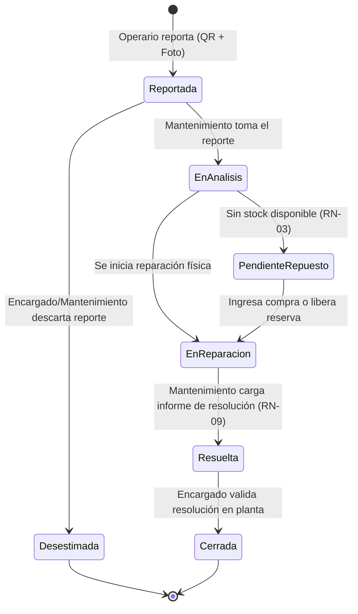
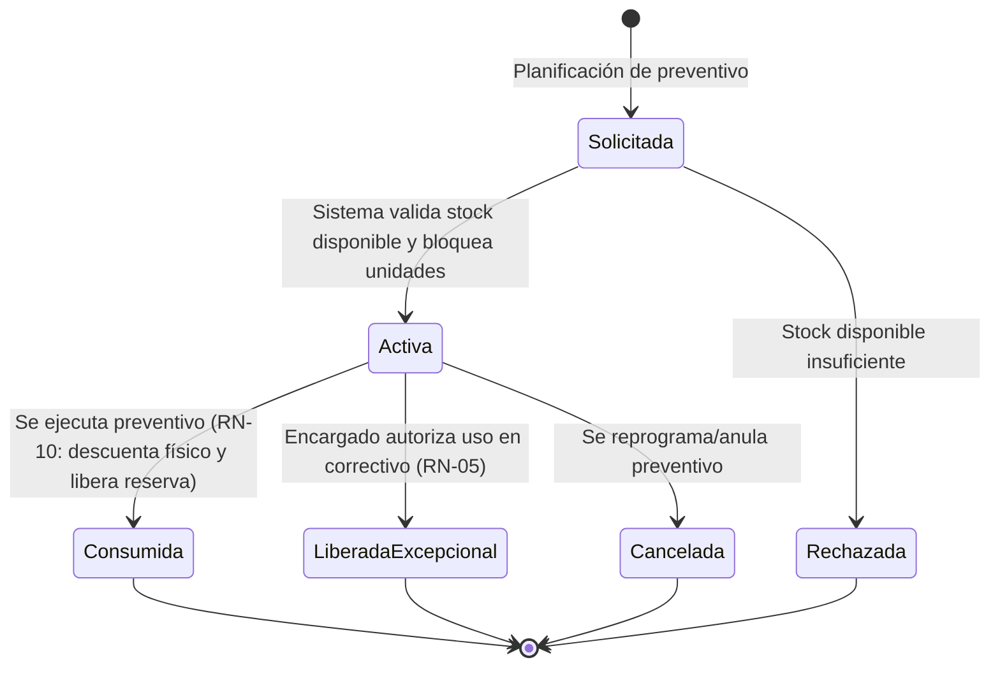
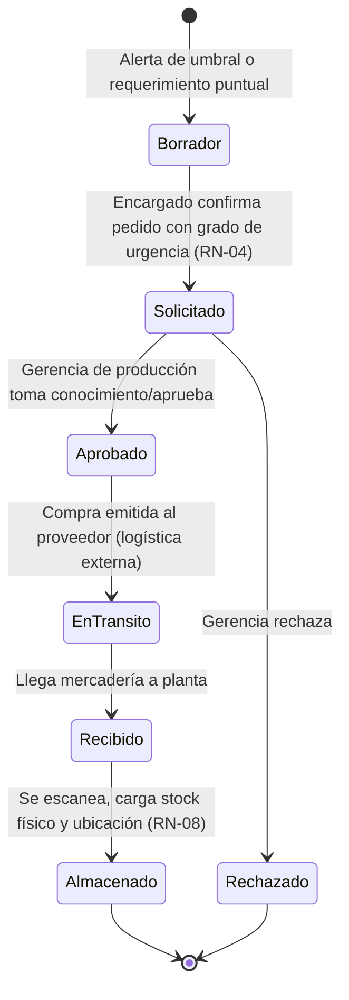
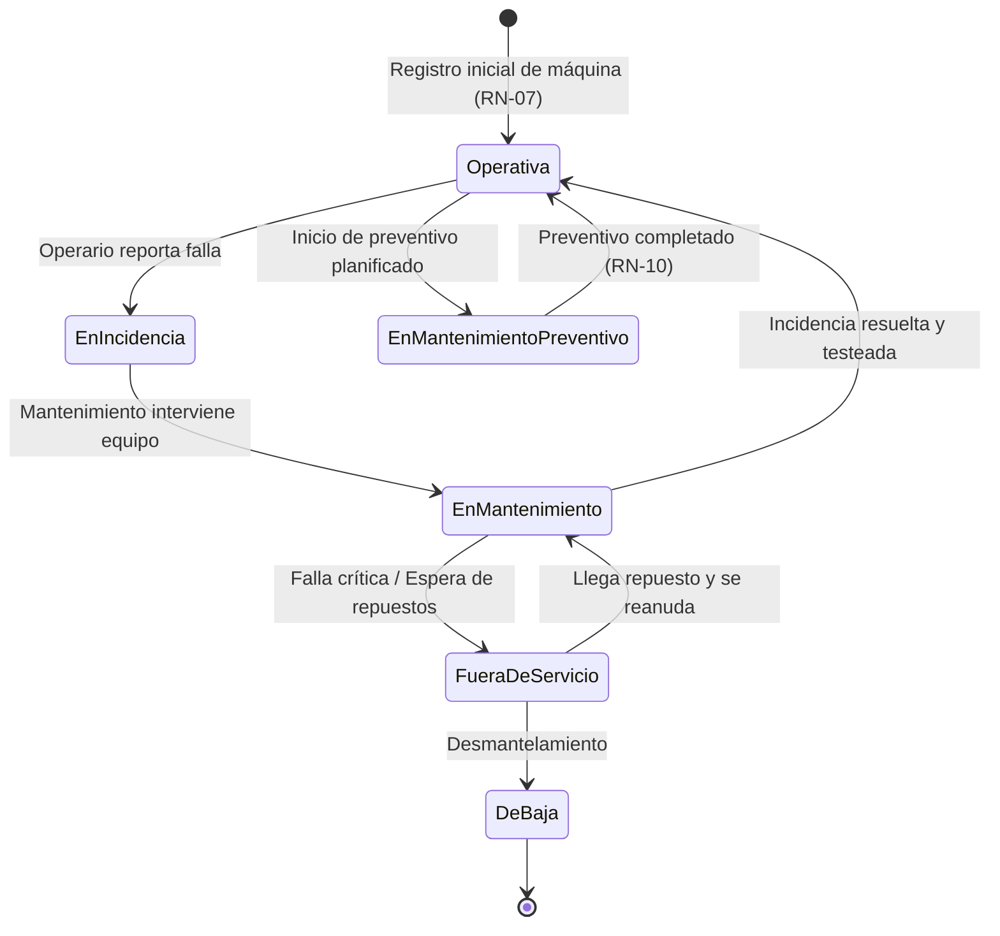

# Máquinas de Estado del Sistema (M1)

> Documento de especificación de estados y transiciones para las entidades críticas del dominio

---

## 1. Máquina de Estados: Incidencia

Una incidencia representa el reporte de un desperfecto o solicitud de mantenimiento sobre una máquina en cualquier turno (RN-07, RN-09).

### 1.1 Diagrama de Estados de INCIDENCIAS

### 1.2 Definición de Estados y Transiciones
Reportada: Estado inicial. Registrada por el operario de máquina desde su celular adjuntando fotos y código QR de la máquina.

EnAnalisis: Mantenimiento evalúa el desperfecto y determina si requiere intervención mecánica/eléctrica y si necesita cero o más repuestos.

PendienteRepuesto: Se activa si se requiere un repuesto y stock_disponible == 0 (RN-03). Dispara solicitud de compra.

EnReparacion: Mantenimiento ejecuta el trabajo físico y registra el consumo de repuestos (RN-01).

Resuelta: El técnico finaliza el trabajo, carga el informe de resolución y se envía notificación por correo (RN-09).

Cerrada: Estado final. El encargado supervisa y da cierre operativo a la incidencia.

Desestimada: Si el reporte fue duplicado, error de operario o falsa alarma.

---

## 2. Máquina de Estados: Reserva de Repuestos
Modela el ciclo de vida de los repuestos apartados para mantenimientos preventivos planificados (RN-05, RN-10).

### 2.1 Diagrama de Estados de RESERVAS

### 2.2 Reglas y Transiciones Críticas
* **Solicitada -> Activa:** Si cantidad <= stock_disponible, incrementa stock_reservado y reduce stock_disponible. No modifica el stock_fisico.
* **Activa -> Consumida (RN-10):** En una misma transacción: se descuenta stock_fisico -= cantidad, se libera stock_reservado -= cantidad y se registra el movimiento de tipo consumo.
* **Activa -> LiberadaExcepcional (RN-05):** Exclusivamente por usuario con rol Encargado. Requiere justificación, desasocia el repuesto reservado y emite aviso inmediato por email sobre el impacto en el preventivo planificado.

---

## 3. Máquina de Estados: Pedido de Compra
Materializa líneas de reposición desde la lista de compras automática (por umbral mínimo) o por rotura de stock (RN-02, RN-03, RN-04, RN-08).

### 3.1 Diagrama de Estados de PEDIDO DE COMPRA

### 3.2 Atributos y Reglas
Grado de Urgencia (RN-04): Valores normal o urgente. Notifica inmediatamente por correo a encargados de todos los turnos y gerencia.

Carga de Stock (RN-08): El paso a Almacenado incrementa stock_fisico, asigna la ubicación alfanumérica (ej. A-03-12) y genera un movimiento inmutable de tipo entrada.

---

## 4. Máquina de Estados: Máquina (Equipo de Producción)
Controla la disponibilidad operativa de calderas, fraccionadores y bandas transportadoras.

