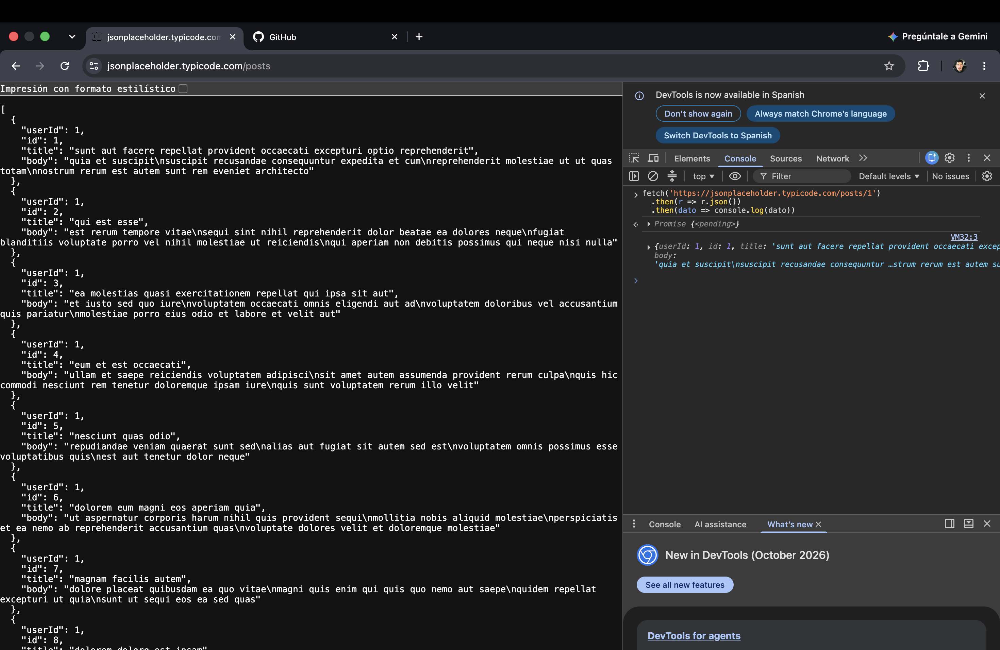
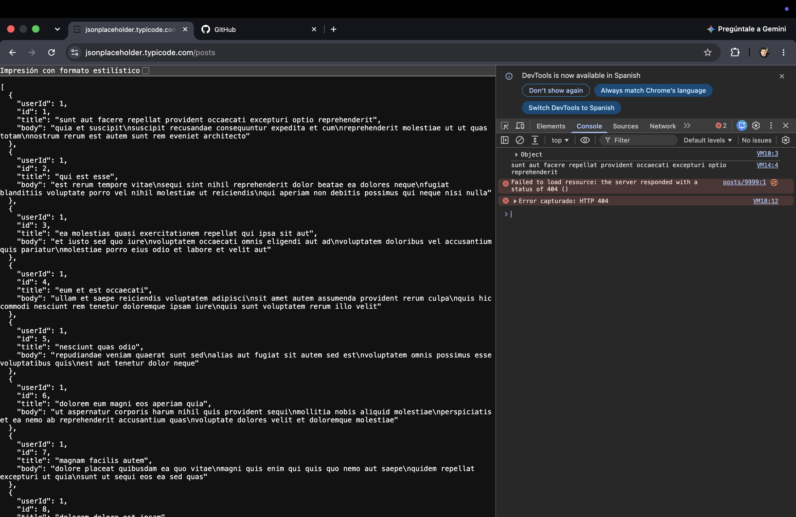
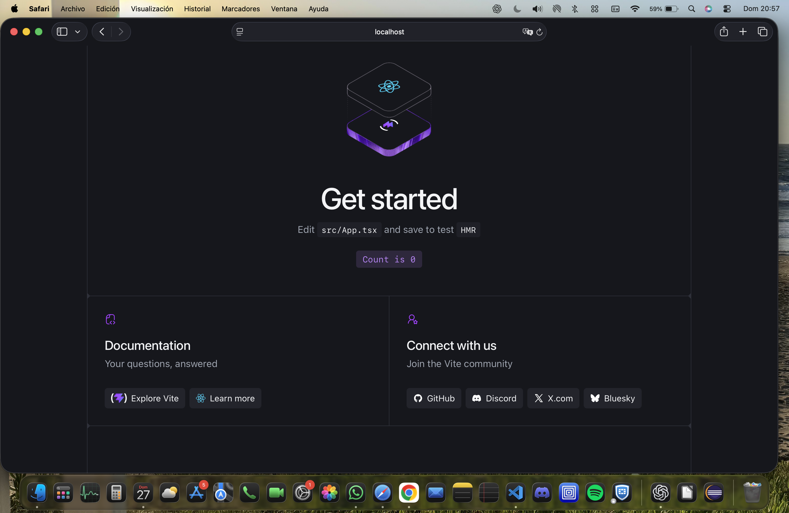
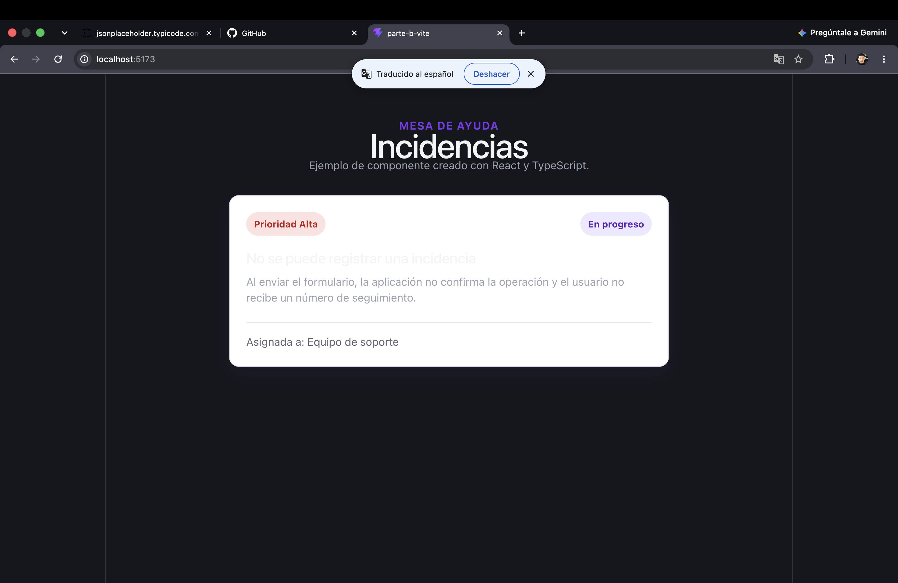
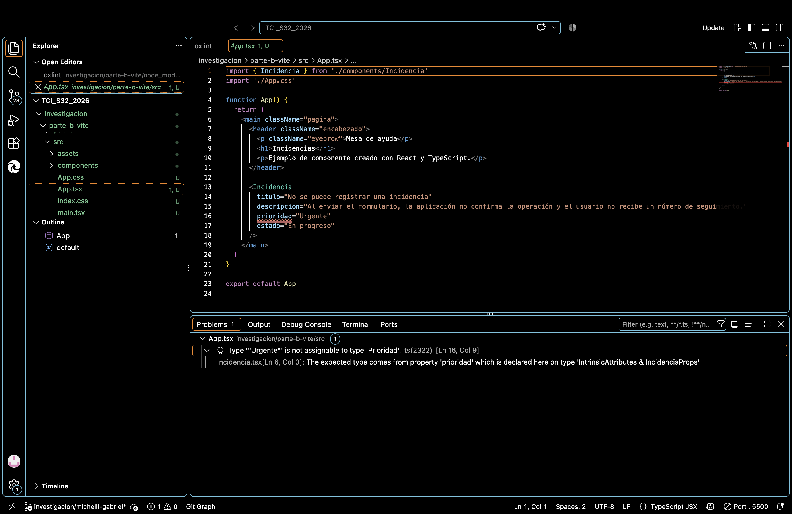
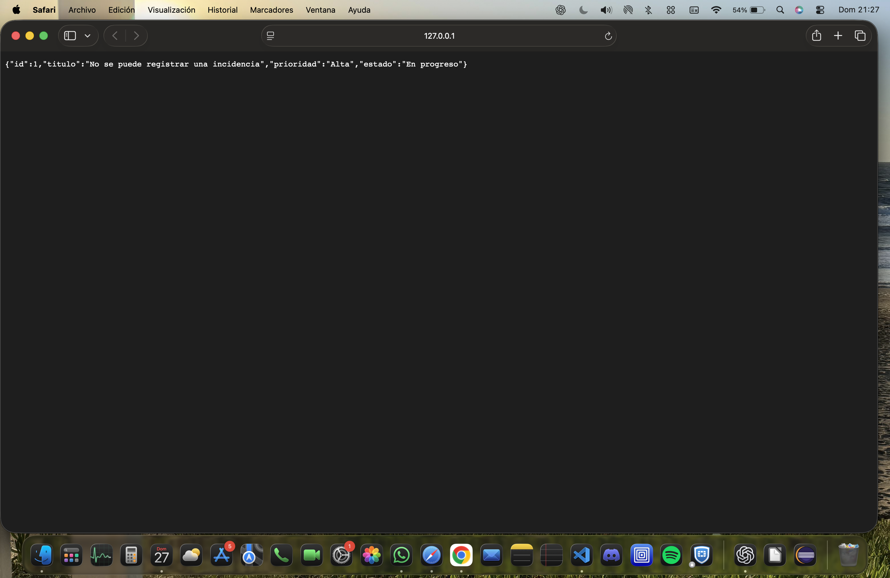

# Investigación — Michelli, Gabriel (Legajo 30820)

## Parte A — JS asincrónico + fetch + SPA

### Preguntas guía
**1. ¿Qué significa que fetch sea asincrónico? ¿Qué pasaría con la página si no lo fuera?**

Que fetch sea asincrónico significa que puede pedir datos a un servidor sin detener el resto de la página mientras espera la respuesta. Mientras los datos llegan, la aplicación puede seguir funcionando y el usuario puede seguir interactuando con ella. Si no fuera asincrónico, la página podría quedar bloqueada esperando la respuesta del servidor.

**2. ¿Por qué respuesta.json() también devuelve una promesa?**

Porque convertir la respuesta recibida a JSON también es una operación asincrónica. Los datos pueden tardar en terminar de recibirse y procesarse, por eso respuesta.json() devuelve una promesa. Esto permite esperar a que los datos estén listos antes de utilizarlos.

**3. ¿Qué relación hay entre una SPA y fetch? ¿Por qué la SPA "necesita" pedir datos así?**

Una SPA funciona principalmente en una sola página y va actualizando su contenido sin recargarla completamente. Para obtener datos del servidor necesita hacer peticiones mientras la aplicación sigue funcionando. fetch permite realizar esas peticiones de forma asincrónica y después actualizar solamente la parte de la página que necesita esos datos.


### Búsquedas

**Búsqueda 1: ¿Cómo funciona fetch en JavaScript?**
- Fuente: MDN Web Docs
- URL: https://developer.mozilla.org/es/docs/Web/API/Fetch_API/Using_Fetch
- Lo que entendí: fetch permite hacer peticiones a un servidor desde JavaScript y devuelve una promesa. Cuando llega la respuesta podemos procesar los datos, por ejemplo usando response.json().

**Búsqueda 2: ¿Qué es una SPA y cómo se relaciona con fetch?**
- Fuente: MDN Web Docs
- URL: https://developer.mozilla.org/en-US/docs/Glossary/SPA
- Lo que entendí: una SPA carga una sola página y después va cambiando su contenido mediante JavaScript sin tener que recargarla completamente. Para obtener información del servidor puede utilizar herramientas como fetch.

### Evidencia de la actividad guiada

**Petición con `fetch` funcionando:**



**Manejo de un error HTTP 404:**



## Parte B — React + TypeScript + Vite

### Preguntas guía

**1. ¿Para qué sirve React en una SPA?**

React permite dividir la interfaz en componentes reutilizables. Cuando cambia un dato, actualiza la parte necesaria de la pantalla sin recargar todo el sitio, por eso es útil para una SPA.

**2. ¿Qué aporta TypeScript al trabajar con componentes?**

TypeScript permite indicar qué datos espera un componente. En `Incidencia` definí el título, la descripción, la prioridad y el estado. Así el editor avisa antes de ejecutar si se pasa un valor inválido, por ejemplo una prioridad que no está permitida.

**3. ¿Qué hace Vite durante el desarrollo?**

Vite crea el proyecto y levanta un servidor local. También actualiza rápido la pantalla cuando guardo cambios, lo que permite probar el componente mientras lo voy escribiendo.

### Búsquedas

**Búsqueda 1: ¿Cómo se tipan las props de un componente React?**
- Fuente: React Documentation
- URL: https://react.dev/learn/typescript
- Lo que entendí: las props se pueden describir con `interface` o `type`. Eso documenta qué recibe el componente y permite detectar valores incompatibles.

**Búsqueda 2: ¿Qué ofrece Vite para desarrollar un proyecto web?**
- Fuente: Vite Documentation
- URL: https://vite.dev/guide/
- Lo que entendí: Vite ofrece un servidor de desarrollo y Hot Module Replacement (HMR), que actualiza los cambios muy rápido mientras se desarrolla.

### Evidencia

**Scaffold de Vite funcionando en localhost:**



**Componente `Incidencia` funcionando:**



**Error de tipos comprobado:**

Durante la práctica se probó temporalmente `prioridad="Urgente"`. TypeScript mostró el error TS2322 porque `Urgente` no pertenece al tipo permitido (`Alta`, `Media` o `Baja`). Luego se restauró `prioridad="Alta"` y el proyecto volvió a compilar correctamente.

```text
Type '"Urgente"' is not assignable to type 'Prioridad'. ts(2322)
```



## Parte C — Contrato OpenAPI + Prism

### Preguntas guía

**1. ¿Qué es un contrato OpenAPI?**

Es un archivo que describe una API: sus rutas, métodos, datos de entrada, respuestas y códigos HTTP. Sirve para que frontend y backend compartan la misma idea de cómo se comunican antes de implementar todo.

**2. ¿Por qué conviene definir el contrato antes de implementar la API?**

Porque reduce malentendidos. El frontend puede saber qué datos va a recibir y el backend qué debe responder. Además, si cambia una ruta o un campo, el cambio queda documentado en un solo lugar.

**3. ¿Para qué sirve Prism?**

Prism puede levantar un servidor simulado a partir del archivo OpenAPI. De esa forma se pueden probar peticiones y respuestas aunque el backend real todavía no exista.

### Búsquedas

**Búsqueda 1: ¿Qué describe OpenAPI?**
- Fuente: OpenAPI Initiative
- URL: https://spec.openapis.org/oas/latest.html
- Lo que entendí: OpenAPI es una especificación para describir APIs HTTP de forma estándar, incluyendo operaciones, parámetros, respuestas y esquemas de datos.

**Búsqueda 2: ¿Cómo funciona el mock de Prism?**
- Fuente: Prism CLI Documentation
- URL: https://github.com/stoplightio/prism/blob/main/docs/getting-started/03-cli.md
- Lo que entendí: el comando `prism mock` lee un documento OpenAPI y crea un servidor local con respuestas simuladas que respetan el contrato.

### Evidencia

**Contrato utilizado:** `parte-c-openapi.yaml`.

**Mock y petición:** se generarán al levantar Prism sobre el contrato local y consultar `GET /incidencias/1`.

```text
Prism is listening on http://127.0.0.1:4010
GET http://127.0.0.1:4010/incidencias/1

{"id":1,"titulo":"No se puede registrar una incidencia","prioridad":"Alta","estado":"En progreso"}
```



## Reflexión

Lo que más me costó fue relacionar los tipos de TypeScript con los datos que recibe un componente. Lo destrabé creando una interfaz para `Incidencia` y probando a propósito un valor inválido. También entendí que OpenAPI y Prism ayudan a probar la comunicación entre partes antes de tener un backend terminado.
