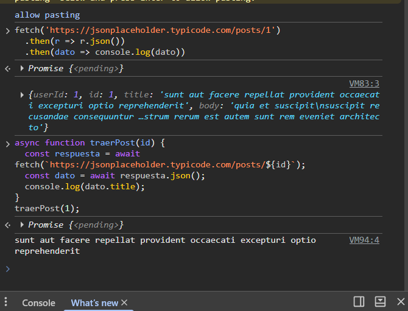
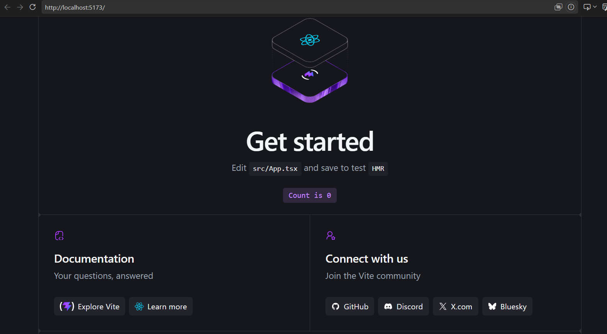
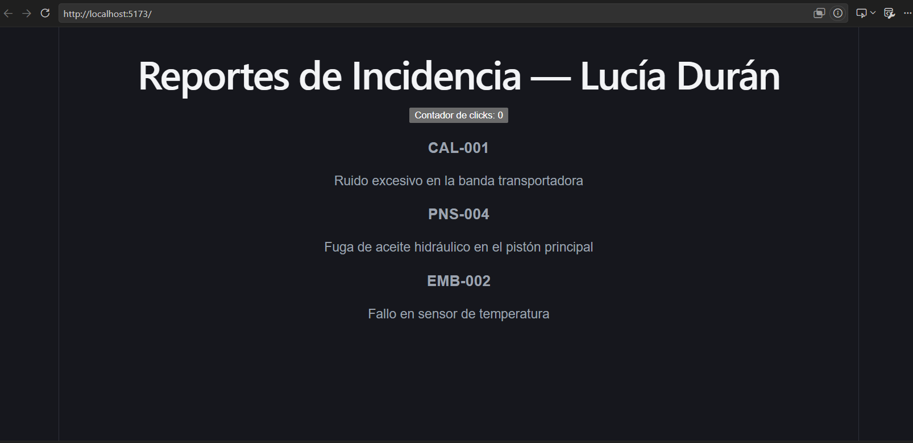
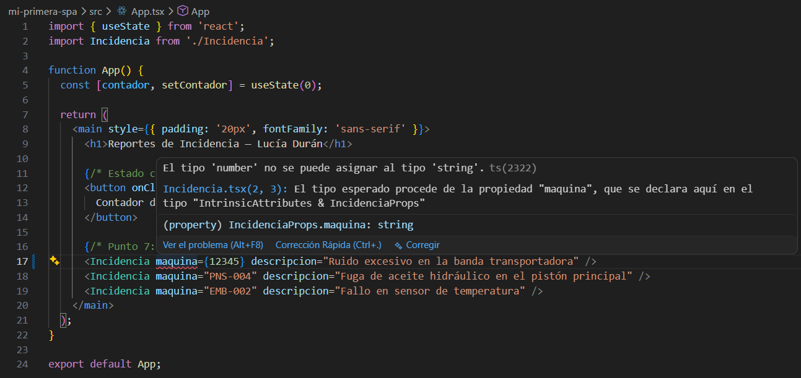
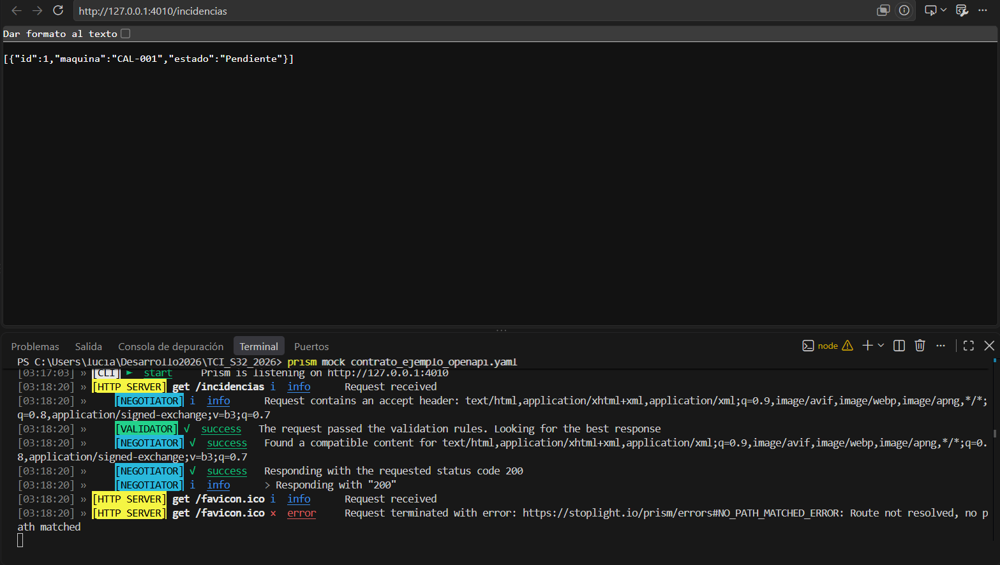

# Investigación — Duran, Lucía (Legajo 33149)

## Parte A — JS asincrónico + fetch + SPA

### Preguntas guía
1. **¿Qué significa que fetch sea asincrónico? ¿Qué pasaría con la página si no lo fuera?**
   Significa que cuando se envía una petición con `fetch`, la ejecución del código no se bloquea esperando la respuesta del servidor; el navegador la procesa en segundo plano y continúa respondiendo a las interacciones. Si fuera sincrónico, la interfaz de la página se congelaría por completo (sin permitir scroll ni clicks) hasta que la respuesta llegue por la red.
2. **¿Por qué respuesta.json() también devuelve una promesa?**
   Porque la conversión del cuerpo de la respuesta HTTP (flujo de datos crudos) a un objeto manipulable de JavaScript requiere tiempo de lectura y procesamiento, por lo que esa operación se ejecuta de forma asincrónica para no bloquear el hilo principal.
3. **¿Qué relación hay entre una SPA y fetch? ¿Por qué la SPA "necesita" pedir datos así?**
   Una SPA (*Single Page Application*) carga un único archivo HTML inicial y nunca recarga la pestaña completa. Necesita pedir datos mediante `fetch` porque es el mecanismo en segundo plano que le permite traer y enviar únicamente datos en formato JSON, actualizando solo los componentes específicos de la pantalla de manera fluida.

### Búsquedas realizadas
- **Búsqueda 1:** SPA vs MPA — *Fuente:* https://developer.mozilla.org/es/docs/Glossary/SPA
  - *Lo que entendí:* Una SPA carga un único documento HTML inicial y actualiza la vista de forma dinámica a medida que el usuario interactúa.
- **Búsqueda 2:** Promesas y async/await — *Fuente:* https://es.javascript.info/async
  - *Lo que entendí:* La sintaxis `async/await` simplifica el consumo de promesas de forma secuencial y legible sin anidar tantos `.then()`.

### Evidencia

---

## Parte B — React + TypeScript + Vite

### Preguntas guía
1. **¿Qué relación ves entre el patrón "separar datos de la vista" que usaste en el taller de incidencia (clase del 14/09) y el estado de React?**
   El patrón de "separar datos de la vista" establece que la lógica de datos debe estar desacoplada del HTML/DOM. En React, el estado (`useState`) representa esa fuente de la verdad (los datos); cuando el estado cambia, React se encarga de re-renderizar y actualizar la vista automáticamente de forma reactiva, evitando tener que manipular el DOM manualmente con funciones como `document.getElementById()`.

2. **¿Por qué el interface IncidenciaProps evita errores? ¿Dónde "vive" esa verificación: en el navegador o en el editor?**
   `IncidenciaProps` evita errores porque actúa como un contrato estricto de los tipos de datos que exige el componente (ej. asegurando que `maquina` sea un `string`). Esta verificación "vive" exclusivamente en el **editor / compilador** (en tiempo de desarrollo) gracias a TypeScript. El navegador no entiende TypeScript; el código se transpila a JavaScript puro antes de ejecutarse en la web.

3. **¿Qué hace Vite que antes hacías a mano (o con un script de <head>)?**
   Vite automatiza el empaquetado del proyecto (*bundling*), transpila el código de TypeScript/JSX a JavaScript estándar, inyecta automáticamente los módulos y archivos CSS sin tener que enlazar decenas de etiquetas `<script>` manualmente en el `<head>`, y proporciona un servidor de desarrollo ultrarrápido con reemplazo de módulos en caliente (HMR) para reflejar los cambios en pantalla en tiempo real sin recargar la pestaña.

### Búsquedas realizadas
- **Búsqueda 1:** Componentes y JSX — *Fuente:* https://es.react.dev/learn
  - *Lo que entendí:* Un componente es la unidad básica de UI reutilizable en React, y JSX permite combinar lógica de JavaScript con estructura HTML.
- **Búsqueda 2:** Props vs State — *Fuente:* https://es.react.dev/learn/state-a-components-memory
  - *Lo que entendí:* Las `props` son parámetros de entrada que vienen del padre, mientras que el `state` es la memoria interna del componente.

### Evidencia

---

## Parte C — Contrato OpenAPI + Prism

### Preguntas guía
1. **¿Por qué conviene definir el contrato antes de codificar frontend y backend? ¿Qué desastre evita?**
   Conviene definirlo antes (enfoque *API-First*) para acordar URLs, métodos y tipos de datos esperados. Evita el desastre de que frontend y backend desarrollen estructuras de datos incompatibles, teniendo que reescribir código a último momento.
2. **¿Cómo ayuda un mock server a que dos personas (una en frontend, otra en backend) trabajen en paralelo?**
   El mock server simula las respuestas de la API basándose en el contrato OpenAPI. Permite que el desarrollador frontend avance probando la interfaz con datos simulados antes de que el backend tenga lista la base de datos o la lógica real.
3. **¿Qué relación hay entre el contrato OpenAPI y las reglas de negocio (RN-STOCK, RN-UMBRAL) que ya documentaste en la M1?**
   El contrato OpenAPI formaliza a nivel técnico las reglas de negocio documentadas en la M1, traduciéndolas en esquemas de validación, tipos de datos obligatorios y códigos de estado HTTP ante solicitudes inválidas.

### Búsquedas realizadas
- **Búsqueda 1:** OpenAPI Specification — *Fuente:* https://learn.openapis.org/specification
  - *Lo que entendí:* Es un estándar internacional escrito en YAML/JSON para describir la estructura y comportamiento de APIs REST.
- **Búsqueda 2:** Prism Mock Server — *Fuente:* https://docs.stoplight.io/docs/prism
  - *Lo que entendí:* Herramienta CLI que genera un servidor HTTP simulado respondiendo datos de ejemplo basados en una especificación OpenAPI.

### Evidencia

---

## Reflexión
Lo que más me costó fue comprender la integración de TypeScript con las props de React y levantar correctamente el servidor mock con Prism. Logré destrabarlo apoyándome en la lectura de la documentación oficial y utilizando la inteligencia artificial como asistente técnico para entender los errores de consola y orientarme paso a paso en cada actividad.